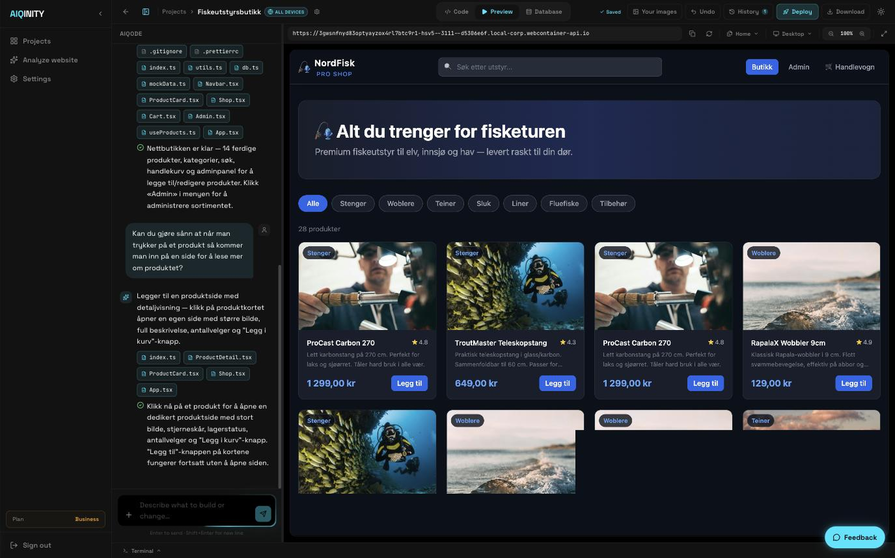
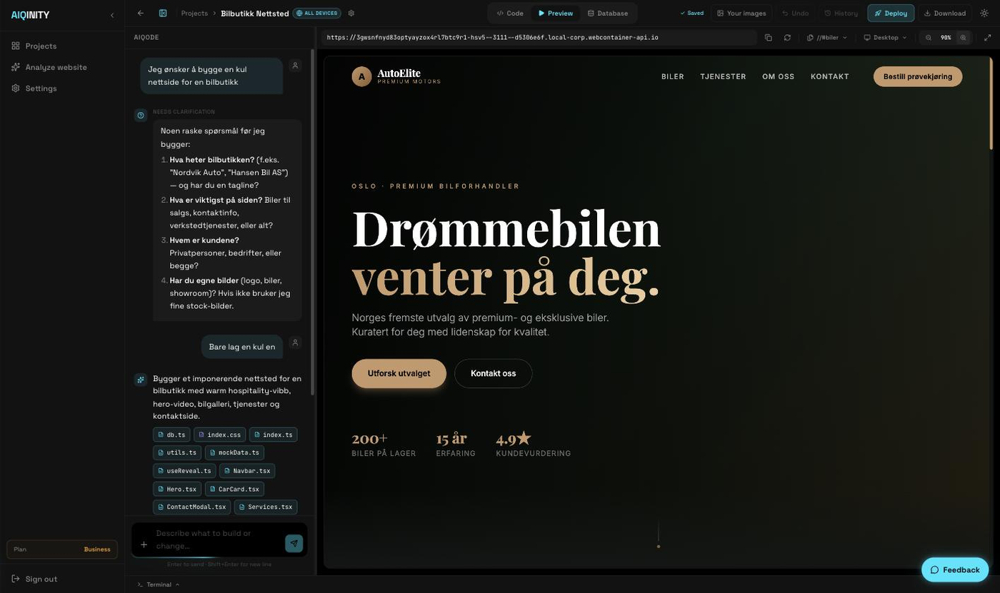
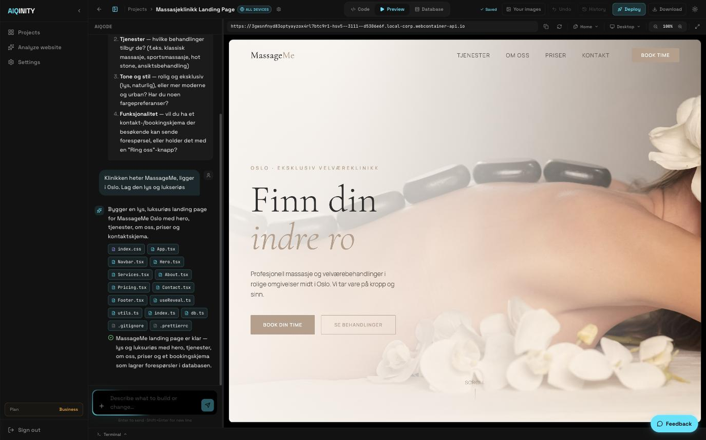
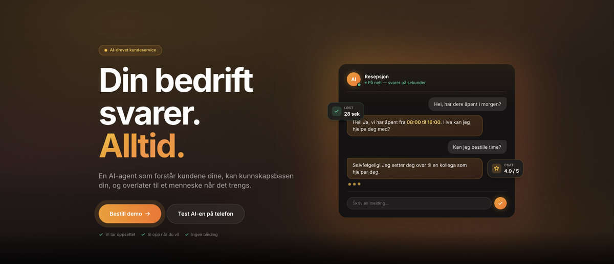

# Hi 👋 I'm Preben

Front-end developer from Noroff, graduated with an A in the final project exam and
portfolio assessment. I build products and take them the whole way — data model, APIs,
real-time audio and video, payments, App Store release and operations — for my own
products and for clients.

Most of what I build lives in private repositories, so the contribution graph on this page
shows the volume rather than the code: **2,152 contributions over the past year, across
125 active days.** Happy to walk through any of it, or share code on request.

## Selected work

| Project | What it is | Built with |
|---|---|---|
| **AIQINITY** | SaaS platform where companies describe what they need in a chat and get a working internal application with its own domain, billing and hosting. Includes a desktop agent written in Rust with a sandbox, a hash-chained audit log and keys in the OS keychain. | Rust, Tauri, Next.js, TypeScript, Supabase, Stripe |
| **Resepsjon.ai** | AI agent that answers incoming calls for businesses. Real-time audio on a self-hosted server, answers from the customer's own documents with RAG, and escalates to a human when it shouldn't answer alone. | Next.js, TypeScript, LiveKit, Twilio, RAG |
| **[TreatMeHome](https://apps.apple.com/no/app/treatmehome/id6762602518)** | Marketplace app for home-based services. Booking, Stripe payments, and a map that handles thousands of live points without stalling. iOS, Android and web from one codebase. | Flutter, Riverpod, Supabase, Stripe |
| **[UpWorld](https://apps.apple.com/no/app/upworld-steps-real-estate/id6761539251)** | Step counter and a game played on the real map: collect coins where you actually walk, hunt rare finds tied to terrain, and buy real buildings with coordinates and floor area. Grew out of Roomr, so the WebRTC rooms are still in it. | Flutter, Node.js, PostgreSQL, WebRTC, LiveKit, maps and geolocation |
| **[Steppin](https://github.com/prebeneide/GetSteppin)** | Activity app for iOS and Android reading motion data straight from the device sensors. Daily goals, friends, leaderboards and charts. Source is public. | React Native, Expo, TypeScript, Supabase |
| **mAIdoctor** | Health app where the conversation remembers the user's history over time, with structured programmes and PDF reports to bring to a doctor's appointment. | React Native, Expo, TypeScript, Supabase |

## AIQINITY — describe it, and it gets built

You write what you need in plain language. The platform asks what it still needs to know,
writes the code, runs it against a real database and puts it online. Below: a webshop with
28 products, categories, search, cart and an admin panel — built and then refined in the
same conversation.

The stack is Next.js and TypeScript on Supabase, with Stripe for billing and per-customer
domains. The part I'm most proud of is the desktop agent: about 3,100 lines of Rust that
let you talk to your own Mac from your phone and have it carry out tasks, with a sandbox
around what it may touch, keys in the OS keychain, and a SHA-256 hash-chained audit log
sealed with HMAC, so every action can be verified afterwards.

## Resepsjon.ai — an AI agent that answers the phone

Incoming and outgoing calls through Twilio, real-time audio on a LiveKit server I run
myself, and answers drawn from the customer's own documents with RAG. The hard part was
never getting it to answer. It was deciding what it must not handle alone, and handing the
call to a human in time.

## On the App Store

### TreatMeHome — book a service, get it done at home

Built from idea to published app: Flutter for iOS, Android and web, Supabase for data and
auth, Stripe for payments, and a clustered map that stays smooth with thousands of points.

### UpWorld — a step counter played on the real map

Your steps are the currency. Coins appear in the streets you actually walk, rare finds are
tied to the terrain you're standing on, and the buildings you buy are real ones, with real
coordinates and floor area, carrying your colour and your name on the map. Motion data
straight from the device sensors, thousands of live objects on the map without stalling,
and an economy with property and rarity behind it. It grew out of Roomr, so the WebRTC
rooms are still in there.

## Tech

**Frontend** — TypeScript, JavaScript, React, Next.js, Vue, HTML, CSS, SCSS, Tailwind, Bootstrap, Styled Components, shadcn/ui, responsive and mobile-first

**Mobile** — React Native, Expo, Expo Router, Flutter, Riverpod, CallKit and ConnectionService, push notifications

**Backend & data** — Node.js, Fastify, Express, REST APIs, GraphQL, Supabase, PostgreSQL, MongoDB, Firebase, Stripe, NextAuth, Python

**AI & real-time** — OpenAI, Anthropic Claude, RAG, WebRTC, LiveKit, Twilio

**Systems** — Rust, Tauri, WebContainers, xterm.js, CodeMirror 6, SHA-256 and HMAC

**E-commerce & CMS** — Shopify (Admin, themes, apps, Storefront API, headless), WooCommerce, WordPress, headless CMS

**Tooling & deployment** — Git, GitHub, Vercel, Netlify, VS Code, monorepos

## Background

I've been building for the web since my teens and writing code since 2020. Before the
code came hundreds of websites and online stores, for clients and for my own business
ideas. Most of it has been built alongside full-time work outside the industry.

I rarely meet a problem I think is impossible. It's usually about finding another way in,
and I don't stop until I've found it.

## 📫 Contact

**prebenfjeldsbo@gmail.com**
